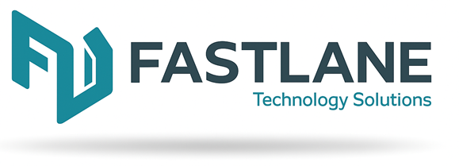
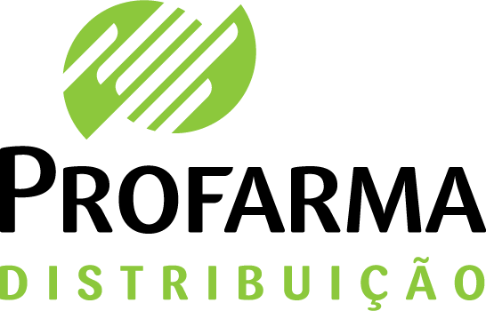
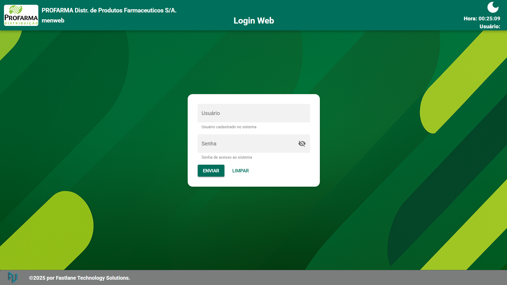

# Modernização Profarma

  
  

## Visão Geral

Modernização do parque de aplicações Profarma: migrando sistemas COBOL com arquivos indexados para backend moderno (Node.js, Python), banco de dados PostgreSQL, integrações via APIs, dashboards avançados, controle de impressoras e suporte a milhares de coletores em múltiplos ambientes (web e terminal).

---

## Sumário

- [Objetivos](#objetivos)
- [Arquitetura e Migração](#arquitetura-e-migração)
- [Funcionalidades e Soluções](#funcionalidades-e-soluções)
- [Exemplos Visuais](#exemplos-visuais)
- [Como usar este repositório](#como-usar-este-repositório)
- [Habilitando Site Estático (GitHub Pages)](#habilitando-site-estático-github-pages)
- [Contato](#contato)

---

## Objetivos

- Migrar sistemas COBOL Microfocus para backend moderno (Node.js, Python etc).
- Converter arquivos indexados COBOL para banco de dados PostgreSQL.
- Permitir acesso web responsivo e por terminais (coletores, putty, etc).
- Substituir conexões legadas (socket, telnet, remote shell) por APIs RESTful/modernas.
- Integração bidirecional com SAP para sincronização de dados.
- Suporte a milhares de coletores de diferentes modelos, tanto via web quanto via terminal moderno.
- Integração com Active Directory (AD) para autenticação e controle de acesso.
- Controle funcional e centralizado de impressão via CUPS, com suporte a diversos modelos.
- Dashboards de controle de acessos, APIs, eventos e auditoria.
- Tratamento de quedas de Wi-Fi nos coletores (modo offline, sincronização automática ao reconectar).
- Bloqueio automático de senha pelo AD (ex: 3 tentativas erradas), com retorno de mensagens de erro detalhadas e página de erro estilizada.

---

## Arquitetura e Migração

- **Migração Gradual:** Dados dos arquivos indexados COBOL são convertidos para estruturas relacionais no PostgreSQL, com ferramentas e scripts de migração.
- **Backends Modernos:** Serviços escritos em Node.js e Python expõem APIs RESTful, substituindo integrações via socket/telnet/remote shell.
- **Frontend Responsivo:** Interfaces web modernas (Quasar, Vue.js, React) e telas adaptadas para emulação em terminais (putty/xterm.js), simulando a experiência COBOL, porém com linguagem e banco atualizados.
- **Integração SAP:** Sincronização de dados via APIs, rotinas agendadas ou filas de mensagens (ex: Kafka/RabbitMQ).
- **Coletores:** Suporte a múltiplos dispositivos, acesso web/mobile, ou via terminal web, garantindo compatibilidade e facilidade de migração.
- **Impressoras:** Gerenciamento via CUPS, permitindo múltiplos modelos e monitoramento centralizado.
- **Autenticação:** SSO com Active Directory, controle de bloqueios, logs de acesso e dashboards.
- **Offline First:** Aplicação preparada para operar sem conexão, sincronizando dados assim que o Wi-Fi voltar.

---

## Funcionalidades e Soluções

- Cadastro, consulta, atualização e exclusão de dados logísticos e operacionais.
- Gerenciamento completo de estoques, inventário e movimentações.
- Emissão de etiquetas e controle de impressão com status em tempo real.
- Painéis de controle e dashboards para monitoramento de usuários, APIs, integrações e eventos.
- Suporte a múltiplos ambientes: web, mobile, coletores, terminais (putty/xterm.js).
- APIs abertas e seguras para integração com SAP, automações, esteiras, etc.
- Página de erro personalizada e informativa para falhas de autenticação ou integração.
- Contingência para quedas de Wi-Fi: cache local e sincronização ao reconectar.

---

## Exemplos Visuais

### Tela de Login (ilustrativa)

> Exemplo ilustrativo de tela de login moderna e responsiva.

### Plano de Fundo Profarma

### Logotipo Fastlane Technology Solutions

---

## Contato

**FLTS Sistemas**  
[https://www.flts.com.br/](https://www.flts.com.br/)  
Email: contato@flts.com.br

**Profarma**  
[https://www.profarma.com.br/](https://www.profarma.com.br/)

---

> Projeto confidencial de modernização dos sistemas Profarma, em parceria com FLTS Sistemas.
